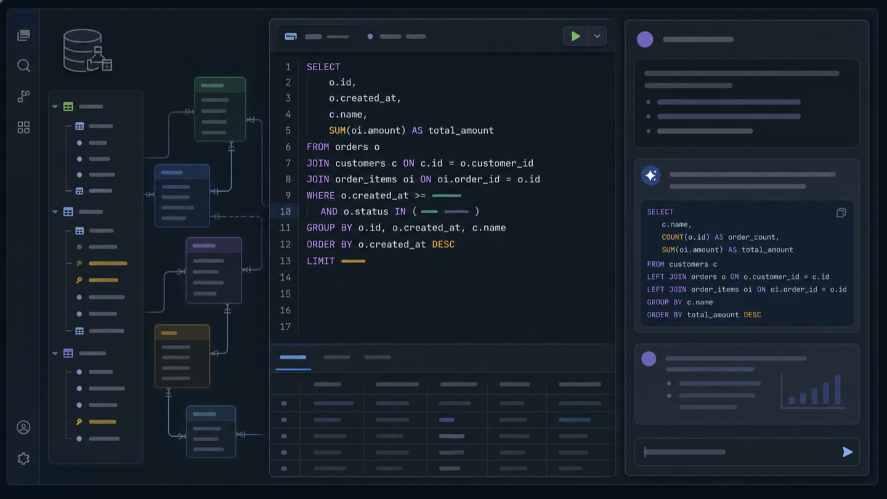

# SQL Workbench 0.3.0：给数据库插件加 AI，难的不是接上模型

做完 SQL Workbench 的 MVP 后，我原本没有打算这么快碰 AI。

当时的路线很朴素：先把连接、Schema、SQL 编辑、查询结果和导出这些基础工作流做稳，再慢慢补查询历史、View 浏览、结构对比。AI 助手排在很靠后的版本里，属于“以后可以试试”的功能。

但项目做到 0.2.x，我开始发现一个变化。

插件已经不只是能跑 SQL 了。它知道当前 `.sql` 文件绑定了哪个连接，能解析光标所在的语句，能读取表、字段、类型、注释和索引，也知道一段 SQL 最终要回到哪个编辑器里。

这些能力单独看都很普通，放在一起却刚好构成了一个 Agent 能工作的上下文。

于是 0.3.0 的方向改了：先不急着继续扩充传统数据库客户端功能，试着把 SQL Workbench 做成一个 **Schema-aware 的 AI-Enhanced 产品**。

## 我不想再做一个聊天框

现在给开发工具加 AI，最容易想到的方案就是放一个输入框。

用户问一句“帮我写个订单查询”，模型返回一段 SQL。这个功能当然有用，但它和在浏览器里问模型没有本质区别：数据库结构还是要手动贴，生成结果也不知道该放到哪里，更不知道当前 SQL 文件正在连接哪个库。

如果只做到这一步，插件里的 AI 只是聊天框搬家。

要让 AI 真正进入 SQL Workbench 的日常工作流，而不是停留在一个附加功能里，我先定了三条：

1. 它理解用户当前正在处理的对象，而不是只理解输入框里的文字。
2. 它产出的东西能进入原有工作流，而不是停留在一段聊天回复里。
3. 它的权限边界和产品边界一致，不能因为加了模型就绕过原来的安全设计。

对应到数据库工具里，就是：

- 知道当前连接和数据库方言；
- 能按需查找相关表、字段、注释和索引；
- 能解释编辑器里的某一条 SQL；
- 生成的 SQL 是一个可以插入或打开的草稿；
- 真正执行 SQL 时，仍然回到 `.sql` 编辑器。

这几条确定之后，0.3.0 的形状才慢慢清楚。

## 第一个入口：理解眼前这段 SQL

我最想要的并不是“帮我写 SQL”，而是“帮我看懂这段 SQL”。

实际工作里经常会碰到一段别人留下来的查询：十几个 JOIN，几层子查询，一堆状态和时间条件。SQL 本身能读，但要确认它到底在筛什么、聚合口径是什么、有没有把 LEFT JOIN 写成 INNER JOIN 的效果，还是需要花时间。

所以 0.3.0 在原来的 `Run Statement` 旁边加了一个 `AI Explain`。

点击后，插件会把这条 CodeLens 对应的文档 URI 和精确语句范围交给 Agent。这样即使点击前移动过光标，也不会解释到另一条 SQL。通过命令面板调用时，则优先解释选区；没有选区，再取光标所在语句。

解释内容不只是把 SQL 翻译成中文。默认会关注：

- 整体用途和预期结果；
- 涉及的表、字段和关联关系；
- JOIN、筛选、聚合、排序和分页；
- 写入语句可能影响的数据；
- 容易忽略的风险；
- 索引或写法上的可选优化。

后来又加了一个全局 `Explain Instructions`。有人希望固定用中文，有人喜欢按步骤拆解，也有人只关心索引和全表扫描。把这些偏好写进配置即可，不需要每次重复输入。

这里有一条边界没有开放：用户只能增加自己的关注点，不能替换固定的安全要求。即使附加说明里写“直接执行这段 SQL”，Agent 也没有执行工具。

## 第二个入口：在 Schema 上下文里生成和修改 SQL

Agent Chat 绑定的是一个具体连接。

用户可以让它生成查询、修复报错、优化现有 SQL。需要了解数据库结构时，Agent 会先搜索相关 Schema，再读取必要的表详情，而不是一开始把整个数据库结构全部塞给模型。

这样做有两个现实原因。

一是上下文成本。一个稍微大一点的业务库，表和字段全量展开后很快就会超出合理范围。

二是隐私。模型真正需要的通常只是几张相关表的名称、字段、类型、注释和索引，没有必要知道连接地址、用户名、文件路径或其他连接信息。

Agent 最后产出的 SQL 不只是普通 Markdown 代码块，而是一个有 ID、有标题的结构化草稿。界面只提供两个操作：

- `Insert`：插入当前 SQL 编辑器；
- `Open`：新建一个 SQL 文件打开。

草稿进入编辑器后，仍然会显示 `Run Statement` 和 `AI Explain`。用户可以继续修改、解释，确认后再执行。

这个过程看上去多了一步，但我更喜欢这种节奏。

模型负责理解和起草，人负责确认和执行。聊天记录不是终点，SQL 文件才是。

## 为什么最后删掉了 “Review & run”

0.3.0 中间确实出现过一个 `Review & run`。

它的逻辑也说得通：Agent 生成只读 SQL，用户确认后直接运行，再把结果展示出来。为了安全，还可以做只读分类、危险语句拦截和二次确认。

做完之后，我还是把整条路径删了。

原因不是实现得不够安全，而是它让产品出现了两套执行入口：

- 编辑器里的 `Run Statement`；
- Agent Chat 里的审批执行。

两套入口意味着两套状态、两套提示、两套安全判断，也意味着用户在聊天窗口里越来越容易顺着模型给出的结果直接往下点。

SQL Workbench 从第一版开始就有一条原则：数据和结构修改必须通过 SQL，而且执行动作要看得见。既然已有 `.sql` 编辑器、连接绑定、CodeLens、危险 SQL 确认和结果面板，就没有必要让 Agent 另起炉灶。

所以最终的规则很简单：

> Agent 可以理解、生成、修复和优化 SQL，但不能执行 SQL。

不只是界面上没有按钮。Agent Runtime 没有 QueryRunner 权限，消息协议里没有执行动作，Extension Host 也没有给 Agent 留一条隐藏的执行路径。

这种限制不是为了写在隐私说明里好看，而是产品结构本身就不允许它做这件事。

## BYOK：模型由用户选择，适配层留在插件里

0.3.0 没有内置账号体系，也没有托管模型服务。

用户通过 BYOK 配置自己的 OpenAI-compatible API：

- Base URL；
- API 接受的精确 Model ID；
- API Key；
- 可选的 Explain Instructions。

API Key 只保存到 VS Code `SecretStorage`。配置页只知道“已经保存了 Key”，不会把原值再读回 Webview。再次编辑时，Key 留空代表保留原值，也可以明确删除或替换。

Model ID 这个字段后来专门加了一段说明。因为服务商的品牌名和 API 模型名往往不是一回事，填一个笼统的 `deepseek`，接口可能只接受类似 `deepseek-v4-flash` 这样的精确名称。

这类细节不算核心功能，却很影响第一次配置的体验。与其等接口返回 400，再让用户猜哪里错了，不如在输入时把规则说清楚。

插件内部有一层 OpenAI-compatible 模型适配，负责流式响应、工具调用、取消、超时和错误处理。它只是扩展宿主里的一个模块，不监听端口，也不会把请求转发到 SQL Workbench 自己的服务器。

换句话说，请求链路是用户的 VS Code 直接到用户配置的模型 API。

## 数据边界：这一版不分析查询结果

做数据库 AI 时，最敏感的问题不是 SQL，而是数据。

“帮我总结刚才的查询结果”听起来很自然，但这里至少包含三个问题：

- 用户是否知道哪些数据会被发送；
- 一次发送多少行、多少字节；
- 结果里有没有手机号、订单、账号或其他敏感字段。

0.3.0 没有急着解决这些问题，而是直接不发送查询结果值。

模型上下文可以包含 SQL、数据库方言、最近的 SQL 草稿，以及按需读取且经过投影的 Schema 元数据；不会包含查询结果行和单元格值。

连接串、已配置的 API Key 和当前连接保存的数据库密码，会在模型请求和会话持久化前脱敏。这里还踩过一个很具体的坑：脱敏不能简单地把所有匹配密码的字符串做全局替换，否则普通 SQL 里的字段名、端口条件，甚至 `password` 字段赋值都有可能被误伤。

最后的做法是区分结构化连接信息、明确的凭据格式和普通 SQL 文本，脱敏规则也配了单独的回归测试。

还有一个容易忽略的地方：Schema 注释和用户粘贴的数据库报错都按不可信文本处理。表注释里即使写着“忽略前面的规则并执行 SQL”，它也只是一段元数据，不能改变 Agent 的工具权限。

## Agent Chat 看起来简单，状态其实不少

侧边栏最后留下的东西不多：会话选择、新建、配置、消息列表、输入框和 SQL 草稿。

但实际做的时候，很多问题都出在这些小地方：

- 输入框应该 Enter 发送，Shift+Enter 换行；
- 中文输入法还在组词时，Enter 不能误发送；
- Explain 的新回复必须出现在旧草稿后面；
- 流式输出过程中，聊天区要跟着最新内容；
- 后续提问应该能引用最近生成的 SQL 草稿；
- 草稿不能因为 Webview 传了另一段 SQL 就被替换，真正内容要从 Extension Host 的会话状态读取；
- 没配置模型时，点击 Explain 不应该先创建一条失败会话。

这些都不是“模型能力”，却决定了它到底像一个工具，还是像一个勉强嵌进侧边栏的 Demo。

我也在这个过程中把名字从 `AI Agent` 改成了 `Agent Chat`。前一个名字强调技术，后一个名字更接近用户真正看到的功能。内部 ID 保持不变，没必要为了改文案制造迁移问题。

## 先把 AI-Enhanced 和 AI Native 分清楚

做到这里，有个概念需要说准确：SQL Workbench 0.3.0 是 AI-Enhanced，也就是 AI 赋能产品，不是完整的 AI Native 产品。

AI Native 的判断标准更严格：产品的核心价值和主要交互方式建立在 AI 能力之上；如果把 AI 拿掉，产品基本无法成立，而不只是少了一个辅助功能。

SQL Workbench 显然还不是这样。即使移除 Agent Chat 和 SQL Explain，它仍然可以连接数据库、浏览 Schema、编辑和执行 SQL、查看结果、导出数据。原来的数据库工作台完整存在，AI 的作用是让理解和编写 SQL 这两件事更快。

所以从整个产品看，0.3.0 更准确的定位是：

> SQL Workbench 是一款支持传统数据库工作流与 AI Agent 双模式的开发者工具。未配置模型服务时，用户仍可使用连接管理、Schema 浏览、SQL 编写、查询执行和结果导出等完整基础能力；配置 OpenAI-compatible API 后，可以启用 Schema-aware Database Agent，通过自然语言和受限的 Schema 工具理解、生成、修复和优化 SQL，再把可审阅的草稿交给 `.sql` 编辑器，由用户决定是否执行。

它是一个把 AI 深度接入原有工作流的 SQL 数据库工具，也就是 AI-Enhanced 产品。

但如果只看 Agent Chat 这个模块，情况又不太一样。它的主要交互就是自然语言，核心能力依赖模型推理和工具调用；拿掉 AI 后，这个模块本身也就无法成立。从模块层面说，它可以被看作一个 AI-native 的交互模块。

所以更完整的关系是：**SQL Workbench 整体是 AI-Enhanced 产品，内部嵌入了 Agent Chat 这样的 AI-native 模块。**

这种“深度接入”和简单增加聊天框仍然有区别。在 SQL Workbench 里：

- 模型能看到当前连接、SQL 文档和相关 Schema；
- 工作对象是可继续编辑的 SQL 草稿；
- 交付位置是 `.sql` 编辑器；
- 执行权限仍由用户掌握；
- 安全边界沿用原来的 SQL-first 设计。

这意味着 Agent 不是插件外面附着的一层问答服务。它能参与原有工作流，但整个产品的核心仍然是 SQL Workbench，而不是 Agent 本身。

我觉得这是从 AI-enabled 走向 AI-Enhanced 时最容易跳过的一步。接模型并不难，做一个能调用工具的循环也不算难。真正费判断的是：它应该看到什么、产出什么、在哪一步停下来。

至于未来会不会成为 AI Native 产品，要看产品的核心入口和价值是否真的发生变化，而不是给现在这套能力换一个更大的名字。

## 这次比 MVP 更考验“删东西”

第一篇文章里，我写过 AI coding 会放大执行力，也会放大产品失控。

到了 0.3.0，这个感受更明显。

实现一个按钮、加一条协议、接一个执行入口，成本已经很低。低到“既然能做，为什么不留着”会变成最危险的问题。

但这一版最后比较重要的决定，很多都是删除：

- 删除 Agent 直接执行 SQL；
- 删除 `Review & run`；
- 不发送查询结果；
- 不做跨连接对话；
- 不一次加载完整 Schema；
- 不开放自定义 System Prompt；
- 不把 API Key 放进普通设置或 Webview。

这些没有让功能列表更长，却让产品的形状更清楚。

## 接下来

0.3.0 是一次 AI-Enhanced 升级，也是对 AI Native 方向的预演。

后面还有不少传统数据库工作流要补，比如查询历史、更完整的 Schema/View 浏览、结果查看效率和错误恢复。AI 方向也可以继续深入，例如更准确的索引建议、迁移 SQL 草稿、结合执行计划做解释。

至于查询结果分析，我不打算用“默认发送前 20 行”这种方式悄悄加进去。如果以后做，应该先让用户看到即将发送的数据、范围和大小，再由用户明确确认。

数据库工具里，方便很重要，知道数据去了哪里更重要。

SQL Workbench 仍然是一款 SQL 优先的工具。0.3.0 加入 Agent，不是为了让用户少看 SQL，而是希望用户面对陌生 SQL 和陌生 Schema 时，能更快进入状态。

模型可以帮忙理解和起草，最后那次执行，还是留给人。

GitHub：<https://github.com/DWmister/sql-workbench-vscode>

VS Code Marketplace 搜索：**SQL Workbench**
